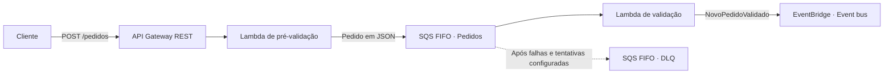
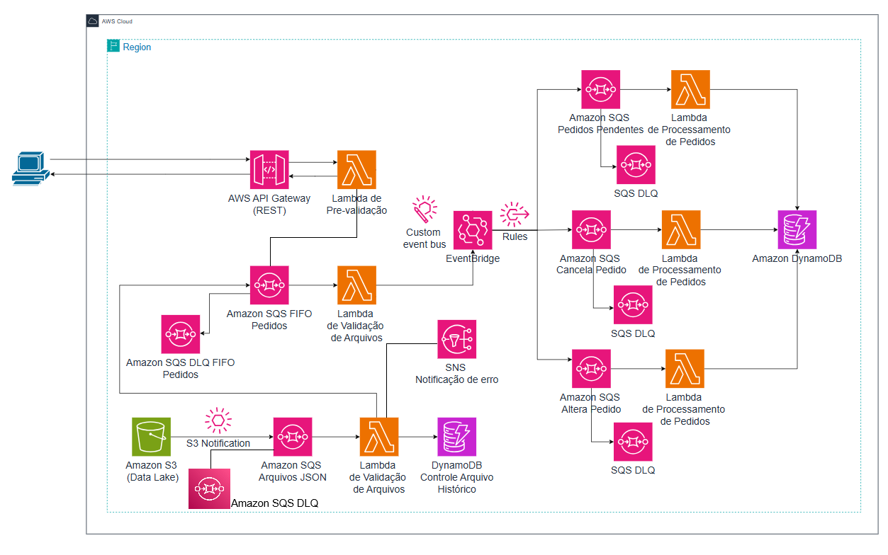
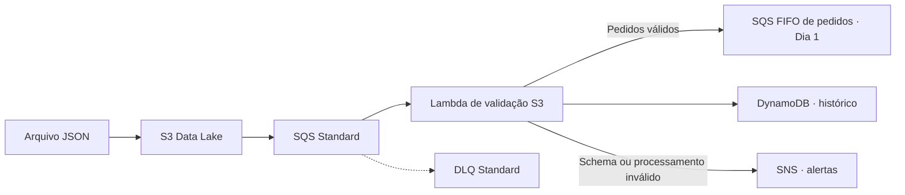
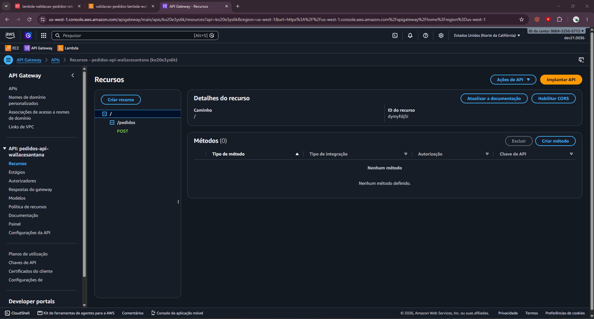
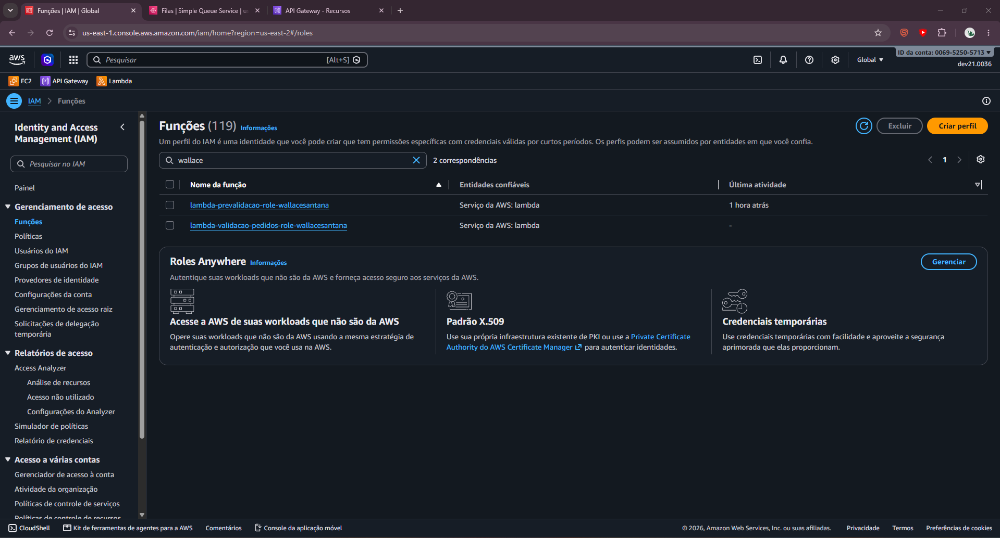
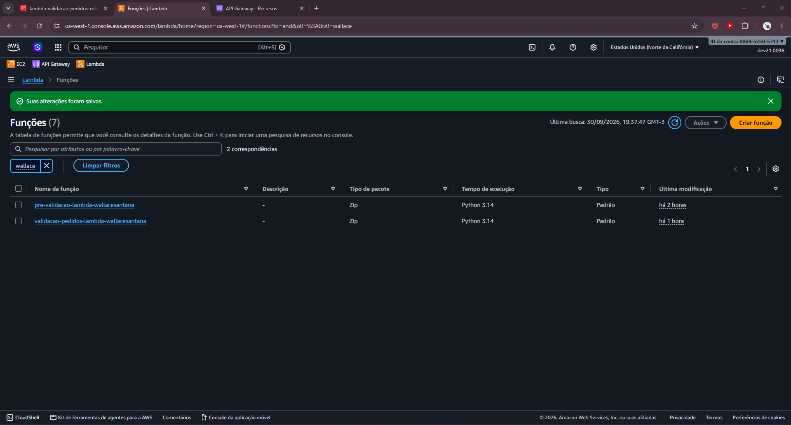
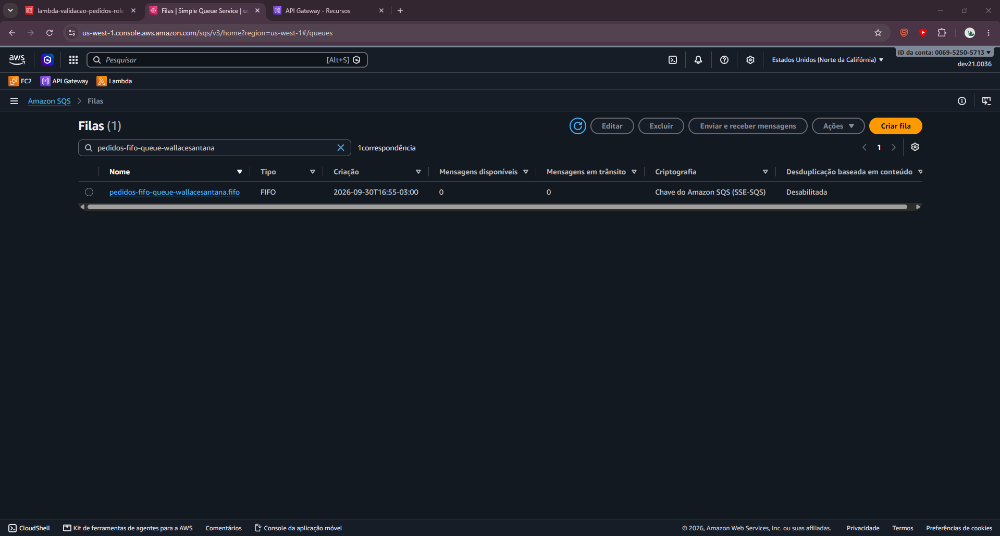
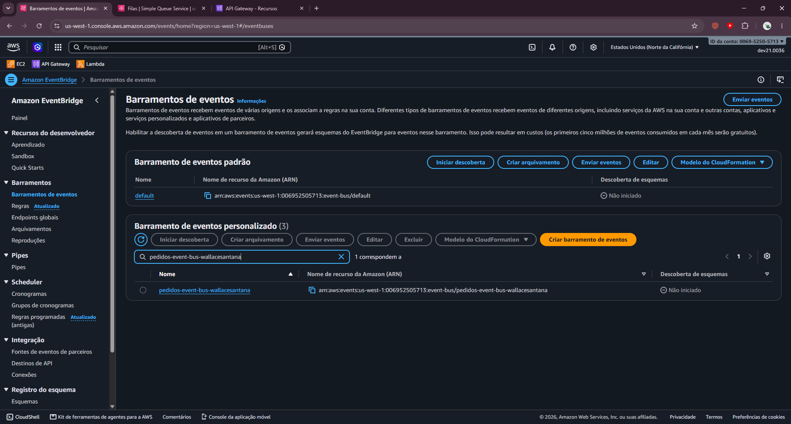

# Semana do Desenvolvedor · AWS Serverless

**Da requisição HTTP ao evento de negócio: construindo um sistema de pedidos na nuvem.**


Repositório de estudos da **Semana do Desenvolvedor AWS**, uma semana de prática da **Escola da Nuvem**, no contexto do curso AWS Developer Associate. O objetivo é desenvolver um sistema serverless de pedidos e registrar código, arquitetura, evidências e aprendizados de cada etapa.

[Arquitetura](#arquitetura) · [Progresso](#progresso-da-semana) · [Como reproduzir](#como-reproduzir) · [Métricas](#métricas-e-acompanhamento) · [Dia 1](day_1/README.md) · [Dia 2](day_2/README.md) · [Dia 3](day_3/README.md) · [Dia 4](day_4/README.md)

## O que este projeto exercita

- Integração de uma API REST com funções Lambda em Python.
- Processamento assíncrono de pedidos com Amazon SQS FIFO.
- Publicação de eventos de negócio no Amazon EventBridge.
- Permissões entre serviços com IAM e investigação de execução por logs.
- Registro da evolução de uma aplicação orientada a eventos.
- Persistência do estado final dos pedidos em DynamoDB.
- Alteração, cancelamento e tratamento com DLQs.

## Arquitetura

### Escopo do Dia 1



1. A pré-validação verifica a presença de `pedidoId` e `clienteId`.
2. O pedido é enviado à fila; a API retorna HTTP `200` com o identificador da mensagem.
3. A segunda Lambda verifica se `itens` é uma lista não vazia, adiciona `timestamp` quando ausente e publica `NovoPedidoValidado`.

**O retorno HTTP confirma o enfileiramento, não a conclusão do processamento.** O código usa `pedidoId` como `MessageGroupId`: a ordenação FIFO é por grupo, não global entre todos os pedidos. Veja a [documentação de grupos FIFO](https://docs.aws.amazon.com/AWSSimpleQueueService/latest/SQSDeveloperGuide/using-messagegroupid-property.html).

### Visão completa do curso



O diagrama acima é a **arquitetura de referência do curso**. Os recursos dos Dias 1 e 2 já possuem material registrado; consumidores posteriores ao EventBridge continuam planejados.

### Escopo do Dia 2



O Dia 2 adiciona ingestão por arquivo, valida `lista_pedidos`, transforma pedidos válidos para o formato do Dia 1, registra o status no DynamoDB e alerta falhas pelo SNS.

## Progresso da semana

| Etapa | Escopo | Situação no repositório |
| --- | --- | --- |
| Dia 1 | API → Lambda → SQS FIFO → Lambda → EventBridge | Código, roteiro e capturas disponíveis |
| Dia 2 | S3 → SQS Standard → Lambda → DynamoDB/SNS/FIFO | Código, dados de teste e evidências disponíveis |
| Dia 3 | EventBridge → SQS Standard → Lambda → DynamoDB | Código, inventário e evidência de sucesso disponíveis |
| Dia 4 | EventBridge → filas de alteração/cancelamento → Lambda → DynamoDB | Código, inventário e 2 evidências de logs disponíveis |
| Próximas etapas | Evolução para a arquitetura completa | A registrar conforme o curso |

O progresso descreve os artefatos disponíveis; não representa uma verificação da conta AWS nem uma porcentagem de conclusão do curso.

## Organização

```text
.
├── README.md                   # Visão geral e painel de acompanhamento
├── day_1/
│   ├── README.md               # Diário, evidências e pendências da aula
│   ├── resume.md               # Resumo original
│   ├── full-context.md         # Roteiro resumido do laboratório
│   ├── created_services.md     # Inventário registrado no laboratório
│   ├── lambda/
│   │   ├── pre-validacao-lambda.py
│   │   └── validacao-lambda.py
│   └── screenshots/            # Cinco capturas do console AWS
├── day_2/
│   ├── README.md               # Diário, testes e evidências da aula
│   ├── full-context.md         # Roteiro resumido
│   ├── lambda/                 # Validação de arquivos S3
│   └── screenshots/test/       # Evidências dos testes do Dia 2
├── day_3/
│   ├── README.md               # Diário, fluxo e pontos a evoluir
│   ├── full-context.md         # Roteiro resumido
│   ├── lambda/                 # Processamento central
│   └── screenshots/test/       # Evidência do processamento
├── day_4/
│   ├── README.md               # Diário, fluxos e pontos a evoluir
│   ├── full-context.md         # Roteiro resumido
│   ├── lambda/                 # Alteração e cancelamento
│   └── screenshots/test/       # Evidências dos dois fluxos
└── docs/
    ├── acompanhamento.md       # Critérios de progresso e medições
    └── arch-diagram.png        # Arquitetura completa de referência
```

Cada nova aula pode seguir o padrão `day_N/`, com um `README.md`, código e evidências. Crie a pasta quando houver material da aula para registrar.

## O que foi feito no Dia 3

- Criada a regra EventBridge para capturar `NovoPedidoValidado`.
- Adicionadas a fila SQS Standard de pedidos pendentes e sua DLQ.
- Implementada a Lambda de processamento central.
- Criada a tabela DynamoDB principal com chave `pedidoId`.
- Registrado o fluxo completo até a persistência do pedido, com evidência em [screenshots/test](day_3/screenshots/test/).

O [README do Dia 3](day_3/README.md) documenta a configuração, o contrato do evento, o teste e os pontos de evolução.

## O que foi feito no Dia 4

- Criadas regras EventBridge para alteração e cancelamento de pedidos.
- Adicionadas filas SQS Standard dedicadas, cada uma com sua DLQ.
- Implementadas Lambdas que atualizam `statusPedido` e `itens` na tabela DynamoDB principal.
- Registrados testes de alteração e cancelamento em [screenshots/test](day_4/screenshots/test/).

O [README do Dia 4](day_4/README.md) documenta o contrato dos eventos, a configuração e a revisão de DLQs.

## O que foi feito no Dia 2

- Criado o canal de ingestão de arquivos JSON pelo S3.
- Configurada a fila SQS Standard para notificações de novos objetos, com DLQ.
- Implementada a Lambda [validacao-s3-arquivos](day_2/lambda/validacao-s3-arquivos-lambda.py).
- Adicionado o histórico de processamento no DynamoDB e o alerta de erros pelo SNS.
- Integrado o resultado válido à fila FIFO de pedidos do Dia 1.
- Registrados cenários de sucesso, schema inválido e alerta SNS em [screenshots/test](day_2/screenshots/test/).

O [README do Dia 2](day_2/README.md) contém o contrato do arquivo, variáveis de ambiente, configuração e checklist de validação.

## Como reproduzir

O provisionamento é manual pelo console AWS; não há infraestrutura como código ou deploy automatizado neste repositório.

### Dia 1 — API e eventos

### Pré-requisitos

- Acesso à conta AWS do laboratório e às permissões previstas no curso.
- Uma região única para os recursos; o inventário original registra `us-west-1`.
- Runtime Python 3.12 conforme o roteiro e `curl` para a chamada HTTP.

O [roteiro do Dia 1](day_1/full-context.md) contém as etapas e o [inventário](day_1/created_services.md) registra os recursos do laboratório.

### Configuração resumida

1. Crie as duas roles IAM para as Lambdas, com permissões de logs e acesso aos respectivos recursos.
2. Crie a DLQ FIFO e a fila principal FIFO; associe a DLQ com `maxReceiveCount = 3`, conforme o laboratório.
3. Crie a Lambda de pré-validação usando [este código](day_1/lambda/pre-validacao-lambda.py) e configure a URL da fila.
4. Crie a API REST com `POST /pedidos`, integração Lambda proxy e publique no stage `dev`.
5. Crie o event bus e a Lambda de validação usando [este código](day_1/lambda/validacao-lambda.py).
6. Configure o gatilho SQS da Lambda de validação com batch size `1`, conforme o roteiro.

No editor de cada Lambda, copie o respectivo código para `lambda_function.py` e utilize o handler `lambda_function.lambda_handler`.

| Função | Variável de ambiente | Valor a configurar |
| --- | --- | --- |
| Pré-validação | `SQS_QUEUE_URL` | URL da sua fila principal FIFO |
| Validação | `EVENT_BUS_NAME` | Nome do seu event bus |

Os nomes, ARNs e endpoints em `created_services.md` são registros do laboratório original. Use os recursos da sua própria conta para reproduzir a prática.

### Enviar um pedido

Substitua o endpoint de exemplo pela Invoke URL do seu stage:

```bash
INVOKE_URL='https://SEU_API_ID.execute-api.SUA_REGIAO.amazonaws.com/dev'

curl -i -X POST "${INVOKE_URL}/pedidos" \
  -H 'Content-Type: application/json' \
  -d '{
    "pedidoId": "lab001-seu-nome",
    "clienteId": "cliente001-seu-nome",
    "itens": [{"produto": "Caderno", "quantidade": 2}]
  }'
```

Resposta esperada da pré-validação após enfileiramento bem-sucedido:

```json
{
  "message": "Pedido recebido e enfileirado",
  "sqsMessageId": "identificador-gerado-pelo-sqs"
}
```

Confira os logs das duas funções e a resposta de `PutEvents` para acompanhar o restante do fluxo. A confirmação de publicação deve considerar `FailedEntryCount` e o resultado de cada entrada; o código atual apenas imprime a resposta. Referência: [API PutEvents](https://docs.aws.amazon.com/eventbridge/latest/APIReference/API_PutEvents.html).

### Dia 2 — Arquivos S3

Siga o [roteiro resumido do Dia 2](day_2/full-context.md). Envie `arquivo_com_pedidos.json` ao bucket para o caminho válido e `arquivo_schema_invalido.json` para o caminho de erro.

Após cada envio, acompanhe a Lambda, a fila FIFO do Dia 1, o item criado no DynamoDB e a mensagem do SNS. As capturas estão em [day_2/screenshots](day_2/screenshots/) e [day_2/screenshots/test](day_2/screenshots/test/).

## Métricas e acompanhamento

**Inventário documental em 30/09/2026**, contado a partir dos arquivos locais:

| Indicador | Valor | Evidência |
| --- | --- | --- |
| Aulas com material registrado | 4 | `day_1/` a `day_4/` |
| Funções Lambda em Python | 6 | `day_1/lambda/` a `day_4/lambda/` |
| Rotas HTTP documentadas | 1 — `POST /pedidos` | Inventário do Dia 1 |
| Capturas de configuração | 19 | Pastas `screenshots/` dos Dias 1 a 4 |
| Evidências de testes do Dia 2 | 3 | `day_2/screenshots/test/` |
| Evidências de testes do Dia 3 | 1 | `day_3/screenshots/test/` |
| Evidências de testes do Dia 4 | 2 | `day_4/screenshots/test/` |
| Diagramas de referência em imagem | 1 | `docs/arch-diagram.png` |
| Testes automatizados | Não disponíveis | Sem suíte de testes no repositório |
| Latência, taxa de erro e custo | Não medidos | Sem exportações de telemetria |

O [painel de acompanhamento](docs/acompanhamento.md) define como registrar resultados e comparar as próximas etapas. Os badges do topo são descritivos; não indicam build, disponibilidade ou deploy verificado.

## Evidências do laboratório



<details>
<summary>Ver capturas de IAM, Lambda, SQS e EventBridge</summary>

### IAM


### Lambda


### SQS


### EventBridge


</details>

Capturas documentam o estado do console naquele momento; não substituem a evidência de um teste completo do fluxo.

## Aprendizados e próximos passos

O Dia 1 introduz desacoplamento, mensageria, permissões entre serviços e integração orientada a eventos. A [análise da aula](day_1/README.md#pontos-a-evoluir) registra limitações observadas no código, incluindo validação de entrada, tratamento de falhas de publicação e idempotência.

Para acompanhar o desenvolvimento, registre ao final de cada aula: o que foi construído, como foi verificado, evidências e pendências. A próxima etapa anunciada no material é a ingestão de arquivos via S3.

---

Desenvolvido por [Wallace Santana](https://github.com/wallacemt) durante os laboratórios da Escola da Nuvem. Repositório educacional de acompanhamento do curso.
