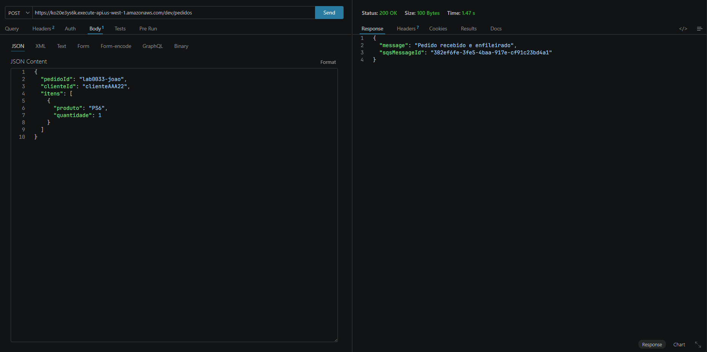
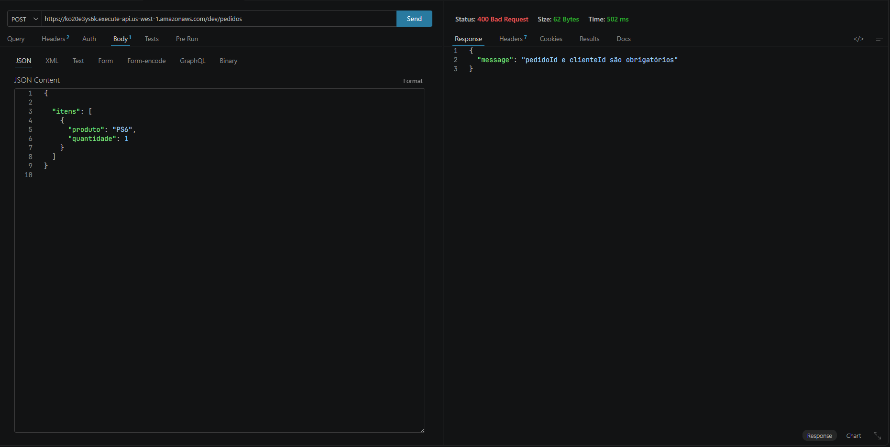
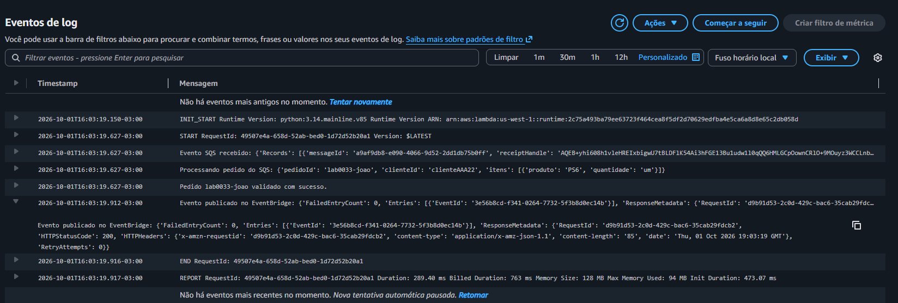

# Dia 1 · Ingestão e validação de pedidos

[← Visão geral](../README.md) · [Roteiro resumido](full-context.md) · [Inventário de recursos](created_services.md)

## Objetivo

Receber pedidos por uma API REST, desacoplar o processamento com SQS FIFO e publicar um evento de pedido validado no EventBridge.

## Material disponível

| Artefato                                          | Conteúdo                                                  |
| ------------------------------------------------- | ---------------------------------------------------------- |
| [Resumo](resume.md)                                | Contexto e objetivo da aula                                |
| [Roteiro](full-context.md)                         | Passo a passo resumido pelo console AWS                    |
| [Inventário](created_services.md)                 | Nomes e identificadores registrados durante a prática     |
| [Pré-validação](lambda/pre-validacao-lambda.py) | Entrada HTTP e envio à fila                               |
| [Validação](lambda/validacao-lambda.py)          | Consumo da fila e publicação do evento                   |
| [Capturas](screenshots/)                           | Evidências de API Gateway, IAM, Lambda, SQS e EventBridge |

## Contrato registrado no código

Os recursos do laboratório seguem a tag `createdBy: "Wallace Santana"`. Mantenha esse padrão ao criar recursos das próximas aulas.

| Etapa                   | Comportamento atual                                                        |
| ----------------------- | -------------------------------------------------------------------------- |
| Entrada HTTP            | Corpo JSON com`pedidoId` e `clienteId` não vazios                     |
| Pré-validação        | Retorna`400` para JSON malformado ou identificadores ausentes            |
| Enfileiramento          | Retorna`200` com `sqsMessageId` após `send_message`                 |
| Agrupamento             | `MessageGroupId = pedidoId`                                              |
| Deduplicação          | `MessageDeduplicationId = context.aws_request_id`                        |
| Validação assíncrona | Exige`itens` como lista não vazia                                       |
| Evento                  | Source:`lab.aula1.pedidos.validacao`; DetailType: `NovoPedidoValidado` |
| Data do evento          | Adiciona`timestamp` quando não existe no pedido                         |

## Validação a registrar

O roteiro descreve os testes,  que foram feitos abaixo:

- [X] Enviar pedido válido e registrar HTTP `200` e `sqsMessageId`.
  - 
  
- [X] Omitir `pedidoId` ou `clienteId` e registrar HTTP `400`.
    - 
- [X] Confirmar a publicação no EventBridge pela resposta de `PutEvents`.
    - 
 
## Continuidade

A próxima aula anunciada no roteiro aborda ingestão de arquivos por S3. Mantenha os recursos necessários à sequência do laboratório conforme as orientações do curso e registre os novos artefatos na pasta da respectiva aula.
