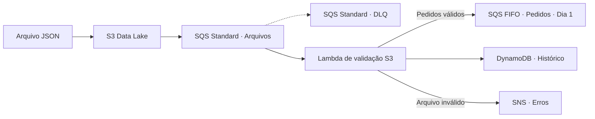
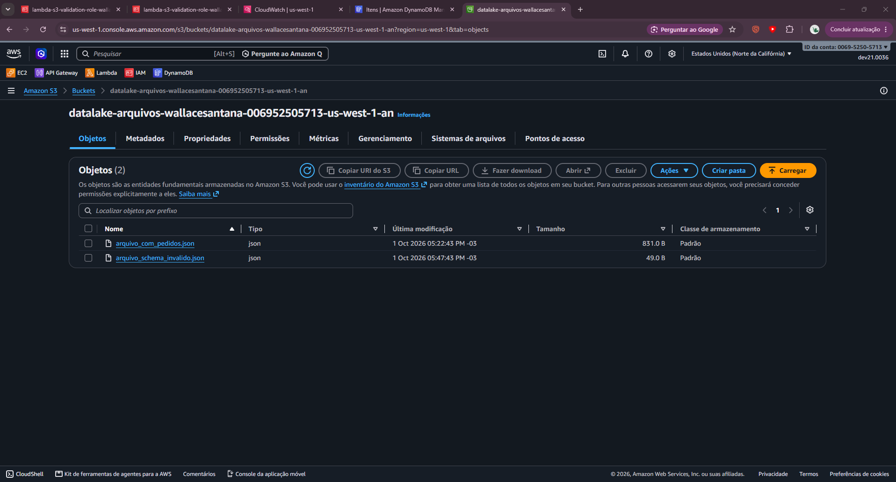
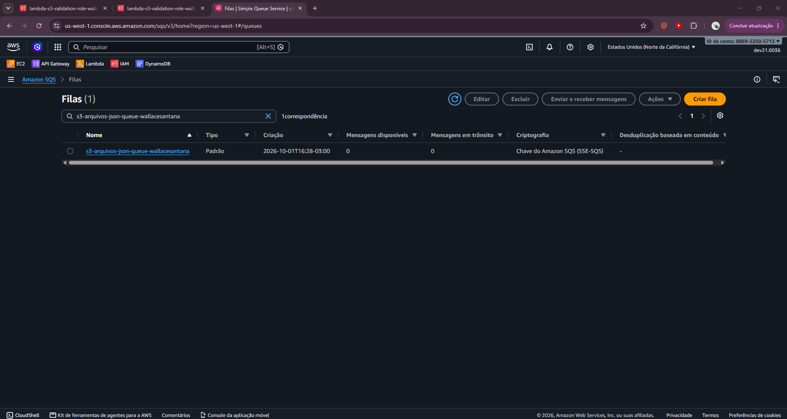
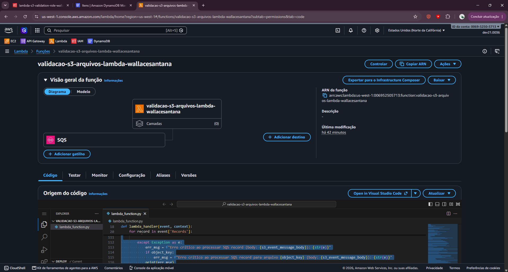
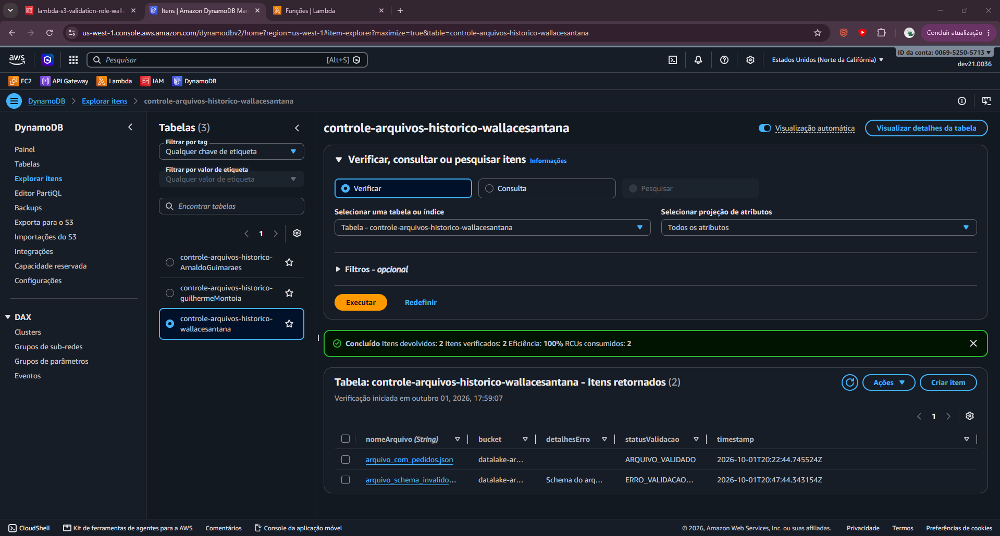
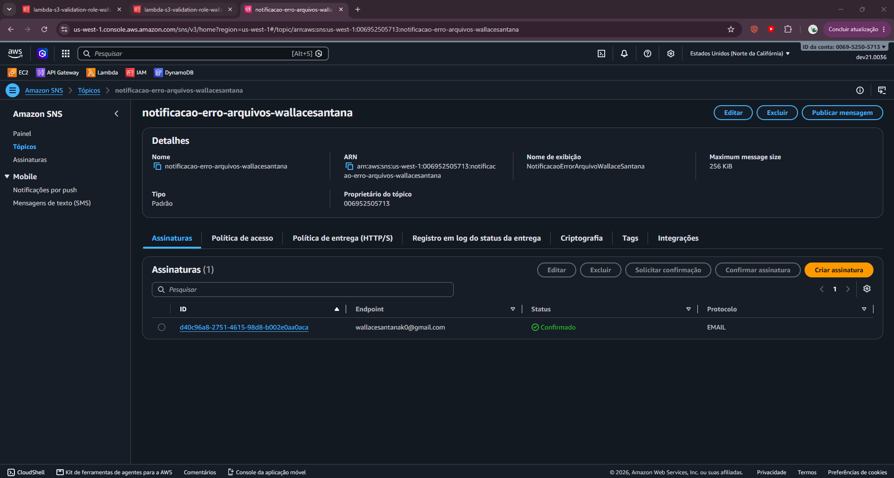

# Dia 2 · Ingestão de pedidos via S3

[← Visão geral](../README.md) · [Roteiro resumido](full-context.md) · [Dia 1](../day_1/README.md)

## Objetivo

Adicionar uma segunda entrada de pedidos ao sistema: arquivos JSON enviados ao S3. O evento percorre uma fila SQS Standard, é processado por uma Lambda e segue para a mesma fila SQS FIFO de pedidos criada no Dia 1.



## Entregas

| Entrega | Situação registrada |
| --- | --- |
| Bucket S3 para JSON | Criado e inventariado |
| SQS Standard + DLQ | Criadas e inventariadas |
| Lambda de validação | Código disponível |
| DynamoDB por `nomeArquivo` | Criado e inventariado |
| SNS para erros | Criado e evidenciado |
| Integração com FIFO do Dia 1 | Implementada no código |

## Arquivos

```text
day_2/
├── README.md
├── full-context.md
├── created_services.md
├── arquivo_com_pedidos.json
├── arquivo_schema_invalido.json
├── lambda/validacao-s3-arquivos-lambda.py
└── screenshots/
    ├── *.png
    └── test/                 # Evidências dos testes
```

## Contrato do arquivo

O arquivo precisa conter `lista_pedidos` como uma lista. Cada pedido válido precisa de `id_pedido_arquivo` e `id_cliente_arquivo` e é transformado para o pipeline principal:

```json
{
  "pedidoId": "S3P001-exemplo",
  "clienteId": "S3C001",
  "itens": [{"sku": "PROD-A", "qtd": 2}],
  "origem": "S3_FILE",
  "nomeArquivoOriginal": "arquivo.json"
}
```

O arquivo [válido](arquivo_com_pedidos.json) contém dois pedidos completos e um pedido sem cliente. O arquivo [inválido](arquivo_schema_invalido.json) não possui `lista_pedidos`.

## Configuração resumida

Adicione `createdBy: "Wallace Santana"` na seção **Tags** de cada recurso criado. Consulte o [padrão geral de tags](../docs/acompanhamento.md#padrão-de-tags-dos-recursos-aws).

1. Crie a role `lambda-s3-validation-role-seu-nome` com logs e permissões para S3, SQS, DynamoDB, SNS e a FIFO do Dia 1.
2. Crie o bucket `datalake-arquivos-seu-nome`.
3. Crie a DLQ e a fila Standard `s3-arquivos-json-queue-seu-nome`, com visibility timeout `30` segundos e `maximum receives = 3`.
4. Configure a notificação de objetos S3 para a fila Standard.
5. Crie a tabela `controle-arquivos-historico-seu-nome`, partition key `nomeArquivo` (String).
6. Crie o tópico SNS `notificacao-erro-arquivos-seu-nome` e confirme a assinatura de e-mail, se usada.
7. Crie a Lambda `validacao-s3-arquivos-lambda-seu-nome` em Python 3.12 com trigger da fila.

Variáveis da Lambda:

| Variável | Valor |
| --- | --- |
| `DYNAMODB_TABLE_NAME` | Nome da tabela de histórico |
| `SNS_TOPIC_ARN` | ARN do tópico de erros |
| `SQS_FIFO_PEDIDOS_URL` | URL da FIFO criada no Dia 1 |

Copie [validacao-s3-arquivos-lambda.py](lambda/validacao-s3-arquivos-lambda.py) para `lambda_function.py`, com handler `lambda_function.lambda_handler`.

## Testes registrados

| Cenário | Resultado esperado | Evidência |
| --- | --- | --- |
| [Arquivo válido](arquivo_com_pedidos.json) | Pedidos válidos na FIFO e histórico registrado | [sucesso](screenshots/test/sqs_success_add_request_by_file_s3.png) |
| [Schema inválido](arquivo_schema_invalido.json) | Status de erro e alerta SNS | [SQS](screenshots/test/sqs-invalid-schema-error.png) |
| Notificação de erro | Mensagem publicada no tópico SNS | [SNS](screenshots/test/sns-message-file-error.png) |

Para repetir: envie cada JSON ao bucket, aguarde a fila Standard e confira CloudWatch, DynamoDB, FIFO e SNS.

## Evidências







## Pontos a evoluir

- Falhas individuais ao enviar pedidos à FIFO são apenas registradas; o arquivo pode continuar como validado.
- A deduplicação usa UUID, então repetir o mesmo arquivo pode gerar novos pedidos.
- O schema ainda não valida tipos e quantidades dos itens.
- `datetime.utcnow()` pode ser substituído por datetime UTC com timezone.

Consulte o [painel de acompanhamento](../docs/acompanhamento.md) para métricas futuras.
