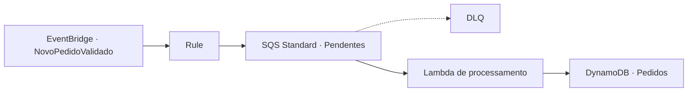

# Dia 3 · Processamento central e persistência

[← Visão geral](../README.md) · [Roteiro resumido](full-context.md) · [Dia 2](../day_2/README.md)

## Objetivo

Consumir os eventos `NovoPedidoValidado` produzidos nos Dias 1 e 2, desacoplar o processamento com uma fila SQS Standard e persistir o pedido processado em uma tabela DynamoDB.



## Entregas

| Entrega | Situação registrada |
| --- | --- |
| Regra EventBridge | Configurada para `NovoPedidoValidado` |
| SQS Standard + DLQ | Recursos criados e inventariados |
| Lambda de processamento | Código disponível |
| DynamoDB principal | Criado com chave `pedidoId` |
| Teste do fluxo | Evidência de sucesso disponível |

## Organização

```text
day_3/
├── README.md
├── full-context.md
├── created_services.md
├── arquivo_com_pedidos_dia3.json
├── lambda/processa-pedidos-lambda.py
└── screenshots/
    ├── *.png
    └── test/success_process_request.png
```

## Configuração resumida

1. Crie a role `lambda-processa-pedidos-role-seu-nome` com logs, leitura/remoção da SQS pendente e escrita na tabela DynamoDB.
2. Crie `pedidos-pendentes-dlq-seu-nome` e `pedidos-pendentes-queue-seu-nome` como filas Standard. Configure visibility timeout de `70` segundos, DLQ e `maximum receives = 3`.
3. Crie `pedidos-db-seu-nome` no DynamoDB com partition key `pedidoId` (String).
4. Crie uma regra EventBridge para eventos com `detail-type = NovoPedidoValidado` e direcione-a à fila pendente.
5. Crie `processa-pedidos-lambda-seu-nome` em Python 3.12, conecte o trigger SQS e configure `DYNAMODB_TABLE_NAME`.

Copie [processa-pedidos-lambda.py](lambda/processa-pedidos-lambda.py) para `lambda_function.py`, usando o handler `lambda_function.lambda_handler`.

## Comportamento da Lambda

A função lê o envelope EventBridge, extrai `detail.pedidoId`, simula o processamento e grava no DynamoDB:

- `statusPedido`: `PEDIDO_PROCESSADO`;
- `clienteId`, `itens` e `origem`;
- timestamps do evento e do processamento;
- `nomeArquivoOriginal` quando a origem é S3.

Registros sem `detail` ou `pedidoId` são ignorados. Erros de JSON e falhas de processamento são relançados para permitir reprocessamento pela SQS e eventual envio à DLQ.

## Teste registrado

O arquivo [arquivo_com_pedidos_dia3.json](arquivo_com_pedidos_dia3.json) fornece um pedido para gerar o evento pelos recursos anteriores. A evidência disponível é [success_process_request.png](screenshots/test/success_process_request.png).

Confira a regra EventBridge, a mensagem na fila, os logs da Lambda e o item criado em `pedidos-db-seu-nome`. HTTP `200` da Lambda indica conclusão do lote recebido; a confirmação de persistência deve ser feita no DynamoDB.

## Pontos a evoluir

- Registros sem `detail` ou `pedidoId` são descartados com `continue`, sem métrica ou alerta.
- A lógica de negócio ainda é simulada e sempre grava `PEDIDO_PROCESSADO`.
- A gravação não usa condição de idempotência; uma repetição pode sobrescrever o pedido.
- `datetime.utcnow()` pode ser substituído por datetime UTC com timezone.
