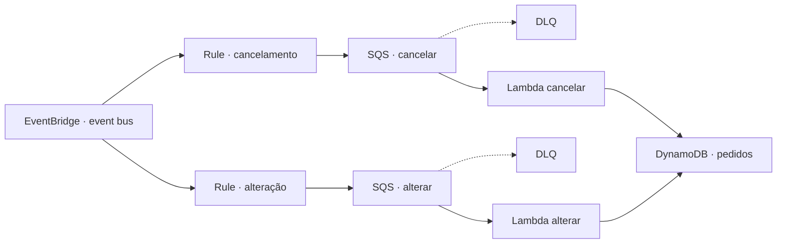

# Dia 4 · Alteração, cancelamento e DLQs

[← Visão geral](../README.md) · [Roteiro resumido](full-context.md) · [Dia 3](../day_3/README.md)

## Objetivo

Completar o ciclo de vida dos pedidos com eventos de alteração e cancelamento. O EventBridge roteia cada tipo para uma fila própria, e Lambdas atualizam a tabela DynamoDB principal.



## Entregas

| Entrega | Situação registrada |
| --- | --- |
| Regra EventBridge de cancelamento | Criada e inventariada |
| Regra EventBridge de alteração | Criada e inventariada |
| Duas filas Standard + DLQs | Criadas e inventariadas |
| Lambda de cancelamento | Código disponível |
| Lambda de alteração | Código disponível |
| Testes dos dois fluxos | Evidências de logs disponíveis |

## Organização

```text
day_4/
├── README.md
├── full-context.md
├── created_services.md
├── lambda/
│   ├── cancela-pedido-lambda.py
│   └── altera-pedido-lambda.py
└── screenshots/
    ├── *.png
    └── test/                 # Logs de alteração e cancelamento
```

## Configuração resumida

Adicione `createdBy: "Wallace Santana"` em cada recurso criado. O [guia de acompanhamento](../docs/acompanhamento.md#padrão-de-tags-dos-recursos-aws) define o padrão.

1. Crie a role `lambda-altera-cancela-role-seu-nome` com logs, leitura/remoção das duas filas e atualização da tabela `pedidos-db-seu-nome`.
2. Crie as filas Standard `cancela-pedido-queue-seu-nome` e `altera-pedido-queue-seu-nome`, cada uma com sua DLQ, visibility timeout de `70` segundos e `maximum receives = 3`.
3. Crie uma regra EventBridge para cancelamento e outra para alteração, direcionando cada evento à fila correspondente.
4. Crie as Lambdas `cancela-pedido-lambda-seu-nome` e `altera-pedido-lambda-seu-nome` em Python 3.12, ambas com `DYNAMODB_TABLE_NAME=pedidos-db-seu-nome` e trigger SQS.

Copie [cancela-pedido-lambda.py](lambda/cancela-pedido-lambda.py) e [altera-pedido-lambda.py](lambda/altera-pedido-lambda.py) para `lambda_function.py` nas respectivas funções.

## Contrato dos eventos

Cancelamento exige `detail.pedidoId` e grava `statusPedido = CANCELADO`. Alteração exige `detail.pedidoId` e `detail.novosItens`, grava os itens e define `statusPedido = ALTERADO`.

```json
{
  "detail-type": "PedidoAlterado",
  "detail": {
    "pedidoId": "S3P00333-wallacesantana",
    "novosItens": [{"sku": "PROD-NOVO", "qtd": 3}]
  }
}
```

## Testes registrados

| Fluxo | Evidência |
| --- | --- |
| Alteração de pedido | [alter_request_log.png](screenshots/test/alter_request_log.png) |
| Cancelamento de pedido | [cancel_request_log.png](screenshots/test/cancel_request_log.png) |

Confira o evento no EventBridge, a entrega na fila correta, os logs da Lambda e o status final em `pedidos-db-seu-nome`. O teste de DLQ deve ser feito com uma mensagem inválida e uma falha deliberada de processamento.

## Pontos a evoluir

- Eventos sem `detail` ou identificador são ignorados com `continue`, sem métrica ou alerta.
- Atualizações não usam condição de existência nem controle de versão.
- Alteração e cancelamento podem ser repetidos sem idempotência explícita.
- `datetime.utcnow()` pode ser substituído por datetime UTC com timezone.
