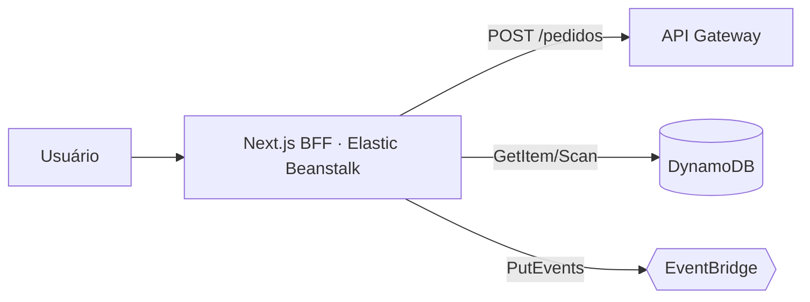

# Camada extra · Front-end Next.js

[← Visão geral](../README.md) · [Dia 4](../day_4/README.md)

Camada adicional (fora do roteiro oficial da Semana do Desenvolvedor): um front-end em Next.js que consome o backend serverless construído nos Dias 1 a 4, sem alterar nenhum recurso existente, e documenta a decisão de arquitetura tomada por causa de uma restrição real de conta.

## Objetivo

Dar uma interface real para criar, consultar, alterar e cancelar pedidos — até aqui só testado via `curl`/console — propondo a arquitetura de produção (containers em ECS Fargate) e implementando, de fato, dentro dos limites de uma conta de laboratório que bloqueia esse caminho por política de Organization.



O Next.js é o único ponto que o browser acessa. Toda leitura/ação além da criação usa o SDK AWS direto (sem Lambda nem rota de API nova), com uma IAM role escopada exatamente aos recursos usados.

## Entregas

| Entrega | Situação registrada |
| --- | --- |
| Arquitetura-alvo (Fargate) documentada | [`docs/architecture.md`](docs/architecture.md) |
| ADR da restrição de conta e decisão (Elastic Beanstalk) | [`docs/adr-001-fargate-vs-elastic-beanstalk.md`](docs/adr-001-fargate-vs-elastic-beanstalk.md) |
| Contrato real dos eventos consumidos | [`docs/event-contracts.md`](docs/event-contracts.md) |
| Front-end Next.js (dashboard, criar/alterar/cancelar) | Código em [`frontend/`](frontend/), implantado |
| Infraestrutura (Terraform) | Código em [`infra/`](infra/), aplicada |
| Deploy funcionando, com dados reais | Capturas em [`screenshots/`](screenshots/) |

## Organização

```text
extra/
├── README.md                                   # este arquivo
├── docs/
│   ├── architecture.md                         # arquitetura-alvo (Fargate) x implementada (lab), diagramas
│   ├── adr-001-fargate-vs-elastic-beanstalk.md  # por que Fargate não é possível nesta conta e o que foi escolhido
│   ├── event-contracts.md                       # contratos reais (API Gateway, DynamoDB, EventBridge) usados pelo front
│   └── created_services.md                      # inventário, ARNs/IDs reais e o incidente de deploy
├── frontend/                                    # Next.js 14 (App Router, TypeScript) — BFF
├── infra/                                       # Terraform (apenas recursos permitidos no lab)
└── screenshots/                                 # Capturas do app em produção
```

## Por que essa camada é diferente das anteriores

Os Dias 1 a 4 seguiram o roteiro do curso. Esta camada é uma extensão própria: parte de uma restrição real de conta (SCP de Organization bloqueando ECS/ECR/ELB/App Runner/Amplify/CloudFront/Lightsail, confirmada via `iam:SimulatePrincipalPolicy`) e documenta a decisão de engenharia tomada por causa dela — ver o [ADR-001](docs/adr-001-fargate-vs-elastic-beanstalk.md).

## Configuração resumida

1. Reaproveita a API Gateway, DynamoDB e EventBridge já criados nos Dias 1 a 4 — nenhuma alteração nesses recursos.
2. `extra/infra` (Terraform) cria uma IAM role mínima, um Security Group e um ambiente Elastic Beanstalk (`EnvironmentType = SingleInstance`, sem ELB). Ver [`infra/README.md`](infra/README.md).
3. `extra/frontend` é buildado **localmente** (`npm run build`) antes do deploy — o `Dockerfile` só empacota o artefato pronto, não compila na instância. Ver [`frontend/README.md`](frontend/README.md#build-de-produção--imagem-docker) e o porquê em [`docs/created_services.md`](docs/created_services.md#incidente-instância-travada-durante-o-redesign-visual).
4. Todo recurso criado leva a tag `createdBy: "Wallace Santana"`, no mesmo padrão dos Dias 1 a 4.

## Contrato dos eventos

O front cria pedidos pela API Gateway (`POST /pedidos`, sem mudança) e consulta/altera/cancela direto via SDK AWS: `dynamodb:GetItem`/`Scan` para leitura, `events:PutEvents` com `detail-type: AlterarPedido` ou `CancelarPedido` (mesmo contrato das rules do Dia 4). Detalhado em [`docs/event-contracts.md`](docs/event-contracts.md).

## Testes registrados

| Tela | Evidência |
| --- | --- |
| Dashboard com pedidos reais do DynamoDB | [app_dashboard.png](screenshots/app_dashboard.png) |
| Criação de pedido (`POST /pedidos` via API Gateway) | [new_request_screen.png](screenshots/new_request_screen.png) |
| Detalhe + alteração de pedido (`PutEvents`) | [edit_request_screen.png](screenshots/edit_request_screen.png) |

URL em produção: http://extra-frontend-env-wallacesantana.eba-jczemvu2.us-west-1.elasticbeanstalk.com. ARNs, IDs e o histórico completo do deploy (incluindo uma instância que travou e precisou ser substituída) estão em [`docs/created_services.md`](docs/created_services.md).

## Pontos a evoluir

- Sem HTTPS: exigiria ACM + domínio próprio, fora do escopo do lab (ver ADR-001). A barra de endereço mostra "inseguro" no navegador.
- `timestampAtualizacao` só é gravado por alteração/cancelamento (Dia 4) — um pedido só processado mostra "—" nesse campo no detalhe; não é um bug, é a ausência real do dado.
- Listagem do dashboard usa `Scan` no DynamoDB — aceitável no volume de um laboratório; um GSI por `statusPedido` seria o próximo passo em escala.
- Sem autoscaling nem alta disponibilidade — `EnvironmentType = SingleInstance`, uma única instância.
- Itens de navegação "Relatórios", "Integrações" e "Configurações" são decorativos (preenchem a UI, sem rota real) — ver `components/Shell.tsx`.

## Leitura recomendada, em ordem

1. [`docs/architecture.md`](docs/architecture.md) — a arquitetura, alvo e implementada.
2. [`docs/adr-001-fargate-vs-elastic-beanstalk.md`](docs/adr-001-fargate-vs-elastic-beanstalk.md) — o porquê.
3. [`docs/event-contracts.md`](docs/event-contracts.md) — exatamente o que o front chama.
4. [`docs/created_services.md`](docs/created_services.md) — inventário e o incidente de deploy.
5. [`frontend/README.md`](frontend/README.md) — como rodar o Next.js localmente.
6. [`infra/README.md`](infra/README.md) — como aplicar o Terraform.
