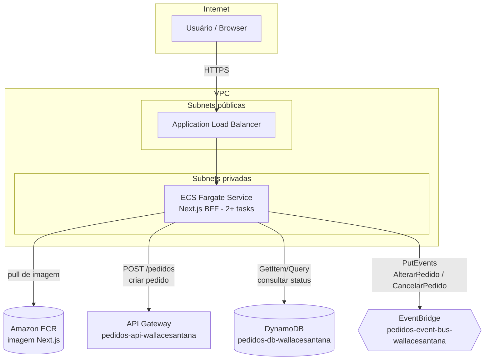
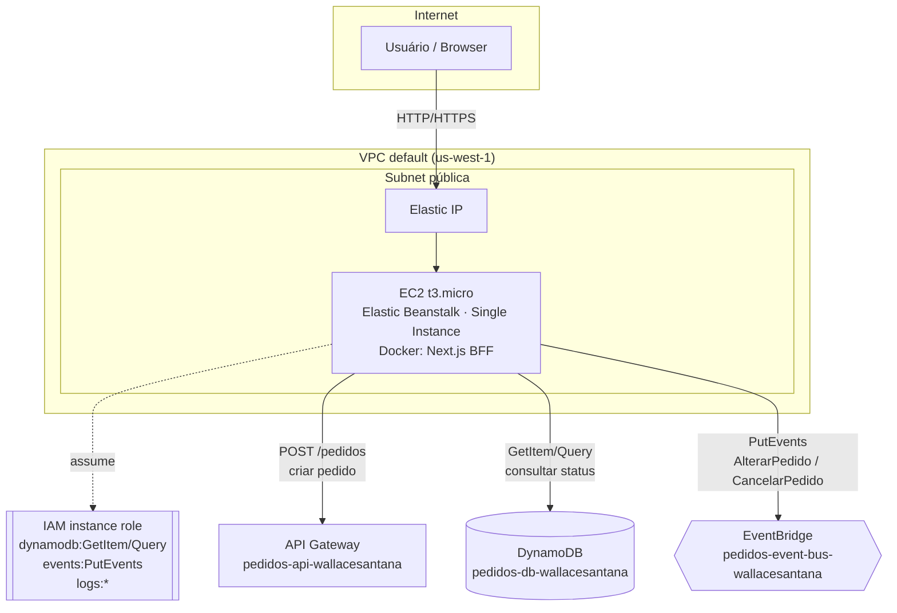
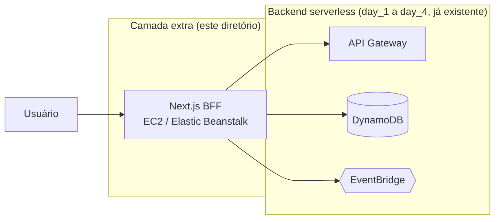

# Arquitetura da camada extra: front-end Next.js

[← Índice da camada extra](../README.md) · [ADR-001](adr-001-fargate-vs-elastic-beanstalk.md) · [Contrato de eventos](event-contracts.md)

Este documento descreve duas versões da mesma arquitetura:

1. **Alvo** — como o front-end seria desenhado em uma conta de produção, sem restrições.
2. **Implementada** — como ele é de fato construído nesta conta de laboratório, que bloqueia por SCP de Organization os serviços necessários para o alvo (ver [ADR-001](adr-001-fargate-vs-elastic-beanstalk.md)).

Nenhum recurso do backend (`day_1` a `day_4`) é alterado. O front-end é 100% aditivo: consome a API Gateway existente para criar pedidos e lê/escreve diretamente no DynamoDB e no EventBridge já provisionados, com uma IAM role nova e mínima.

## Arquitetura alvo (produção, sem restrições de conta)

- **ALB** em subnets públicas, **tasks Fargate** em subnets privadas (sem IP público), saída para a internet via NAT Gateway.
- **Auto scaling** do ECS Service por CPU/memória ou pela métrica de requisições do ALB.
- **CI/CD**: build da imagem, push no ECR, atualização da task definition e deploy do service (rolling update) a cada merge.
- **Observabilidade**: logs das tasks no CloudWatch Logs, métricas do ALB/ECS no CloudWatch, alarmes para erro 5xx e CPU alta.
- **Segurança de rede**: Security Group do ALB aceita 443 do mundo; Security Group das tasks só aceita tráfego do SG do ALB.

Essa é a arquitetura que entra no portfólio como "arquitetura de produção proposta" — mostra o desenho correto mesmo sem poder provisioná-lo aqui.

## Arquitetura implementada (conta de laboratório)

- **Elastic Beanstalk, ambiente "Single Instance"**: não cria Application Load Balancer nem Auto Scaling Group — usa uma única instância EC2 com um Elastic IP. Isso contorna o bloqueio de `elasticloadbalancing:*` no SCP do lab (ver ADR-001), já que o próprio EB nunca chama essa API neste modo.
- **Plataforma Docker** do EB: builda a imagem a partir do `Dockerfile` do front-end a cada deploy (`eb deploy` / upload do bundle).
- Usa a **VPC default já existente** (`vpc-02503d3297358cfbc`) e uma das subnets públicas — nenhuma VPC nova é criada.
- **IAM instance role** nova (`extra-frontend-instance-role-wallacesantana`), escopada exatamente aos ARNs da tabela e do bus — nunca `*`.
- **Sem HTTPS customizado** (certificado próprio exigiria ACM + domínio, fora do escopo do lab); fica documentado como próximo passo caso a conta permita.
- Todos os recursos criados pelo Terraform levam a tag `createdBy: "Wallace Santana"` (`extra/infra/main.tf`), no mesmo padrão de identificação de autoria usado na conta do lab.

## Papel do Next.js como BFF

O browser fala só com o Next.js. Não existem chamadas diretas do cliente a serviços AWS, nem credenciais expostas no front. O servidor Next.js (rodando dentro da instância com a instance role) é o único ponto que:

| Ação do usuário | Rota interna (`app/api`) | Chamada AWS feita pelo servidor |
| --- | --- | --- |
| Criar pedido | `POST /api/pedidos` | `fetch` HTTPS na API Gateway existente (`POST /pedidos`) — sem credenciais AWS, é um endpoint público |
| Listar / consultar pedido | `GET /api/pedidos`, `GET /api/pedidos/{id}` | `dynamodb:Query` / `GetItem` via AWS SDK v3, usando a instance role |
| Alterar pedido | `PATCH /api/pedidos/{id}` | `events:PutEvents` (`source=lab.aula4.operacoes`, `detail-type=AlterarPedido`) |
| Cancelar pedido | `DELETE /api/pedidos/{id}` | `events:PutEvents` (`source=lab.aula4.operacoes`, `detail-type=CancelarPedido`) |

Nenhuma Lambda ou rota de API Gateway nova é criada para alteração/cancelamento/consulta — o BFF reaproveita o contrato de eventos e a tabela que já existem (ver [event-contracts.md](event-contracts.md)).

## Comparativo

| Aspecto | Alvo (Fargate) | Implementado (lab) |
| --- | --- | --- |
| Compute | ECS Fargate (serverless containers) | EC2 single instance (via Elastic Beanstalk) |
| Load balancing | Application Load Balancer | Nenhum — Elastic IP direto na instância |
| Rede | VPC com subnets públicas/privadas + NAT | VPC default, subnet pública |
| Escalabilidade | Auto scaling por métrica | Fixa (1 instância) |
| Registro de imagem | Amazon ECR | Build local pelo próprio Elastic Beanstalk |
| Por que a diferença | — | SCP do lab bloqueia `ecs:*`, `ecr:*`, `elasticloadbalancing:*` |

## Diagrama de contexto (como a camada extra se encaixa no projeto)

